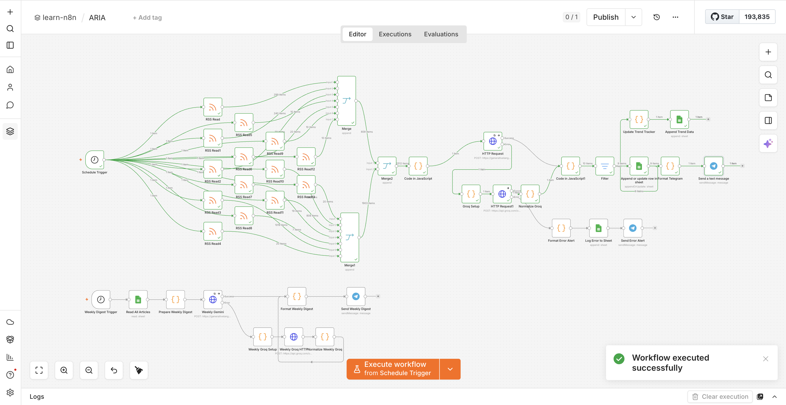
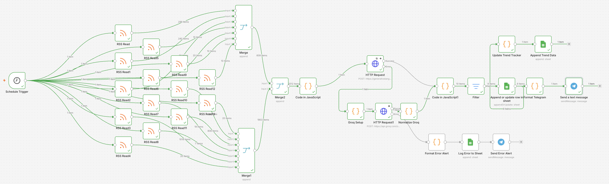
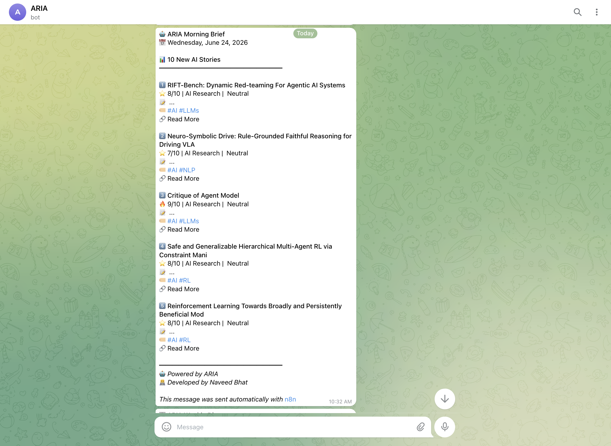

# ARIA — AI Research Intelligence Assistant

  

## Overview
ARIA is an intelligent n8n automation that curates, analyzes, and delivers daily AI/tech news briefings via Telegram. It aggregates articles from 10+ RSS feeds, scores them using Gemini AI (with Groq fallback), and sends beautifully formatted summaries directly to your Telegram.

## Features
- 🔄 Automated daily news curation from 10+ RSS sources
- 🤖 Dual-AI analysis (Gemini → Groq fallback)
- 📊 Relevance scoring (1–10)
- 📱 Telegram delivery with rich formatting
- 📈 Trend tracking via Google Sheets
- 🛡️ Error handling & alert system

## Tech Stack
- **Automation**: n8n
- **Primary AI**: Google Gemini 2.0 Flash
- **Fallback AI**: Groq (Llama 3.1)
- **Storage**: Google Sheets
- **Delivery**: Telegram Bot API

## Setup
1. Import `ARIA.json` into your n8n instance
2. Add credentials:
   - Google Gemini API key
   - Groq API key
   - Google Sheets OAuth2
   - Telegram Bot token
3. Activate workflow

## Screenshots
| Workflow | Bot Output |
|----------|-----------|
|  |  |

---
*Developed by Naveed Bhat*
